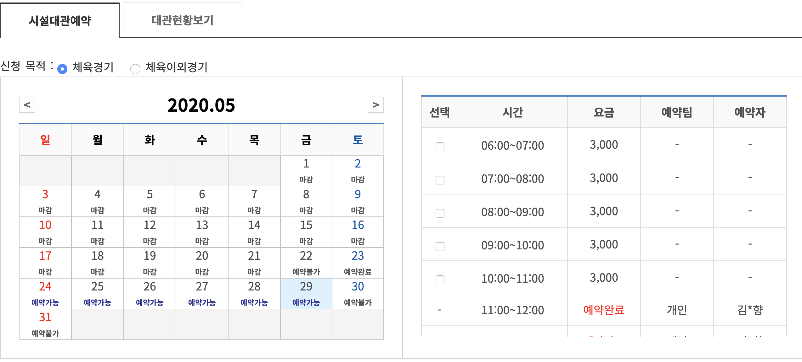

# 코트 수동 예약 시스템

## GUIDE
1. 코트/날짜/시간대 까지 설정된 정보 입력 화면으로 바로 넘어가는 바로가기(**quick link**) 링크 생성
2. 미리 입력한 필수 입력 정보를 바로 채워주고, 신청버튼 클릭하는 북마클릿(**Bookmarklet**) 생성
3. 두 개의 북마크를 북마크바에 드래그 한 후에 대기
4. 대관 신청이 활성화되는 타이밍
  - 경험으로 비추어보면 대략 컴퓨터 시간 기준으로 3초정도의 편차가 있고
  - <a href="https://www.gunpouc.or.kr/fmcs/157" target="_blank">대관신청 페이지</a>로 이동한 후, 센터/시설/장소/날짜를 선택하면 시간표가 나오는데 그걸로 확인하는게 정확합니다. 
  
    
5. 컴퓨터 시계를 보면서, 오전 8시 59분 55초 정도부터 매 초 새로고침을 하시다가
6. 여기 선택 부분이 비활성(-)에서 활성(체크박스) 상태로 바뀌면, **quick link**를 눌러서 입력 페이지로 이동 후, 바로 **Bookmarklet** 클릭하면 끝
    
### 주의 사항
1. <a href="http://www.gunpouc.or.kr/fmcs/1" target="_blank">군포도시공사</a> 로그인 되있어야 합니다.
2. 필수 정보 입력 필드를 모두 올바르게 입력 후 **Bookmarklet** 생성하세요.
3. **quick link**는 단순 링크기 때문에 어느 페이지에서나 눌러도 괜찮지만, **Bookmarklet**은 반드시 입력 페이지로 이동후 눌러야 동작합니다.

----

참고 영상<a href="https://www.youtube.com/watch?v=BDh2vAp4L2c&feature=youtu.be" target="_blank">(유튭)</a>

<video controls width="100%">
  <source src="./video.mp4" type="video/mp4">
</video>

영상에서는 배경 녹화라 컴퓨터 시계바가 안나오지만, 우측 하단에 컴퓨터 시간을 계속 확인하고 있습니다. (중간중간 멈춰있는 건 시간이 아직 안되서 멍때린거에요. 참고로 58분정도부터 녹화했습니다.